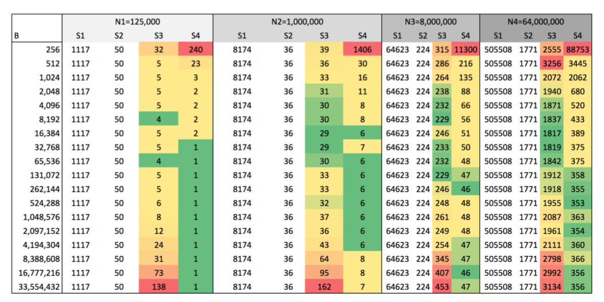
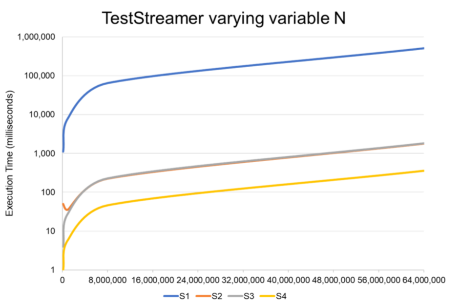
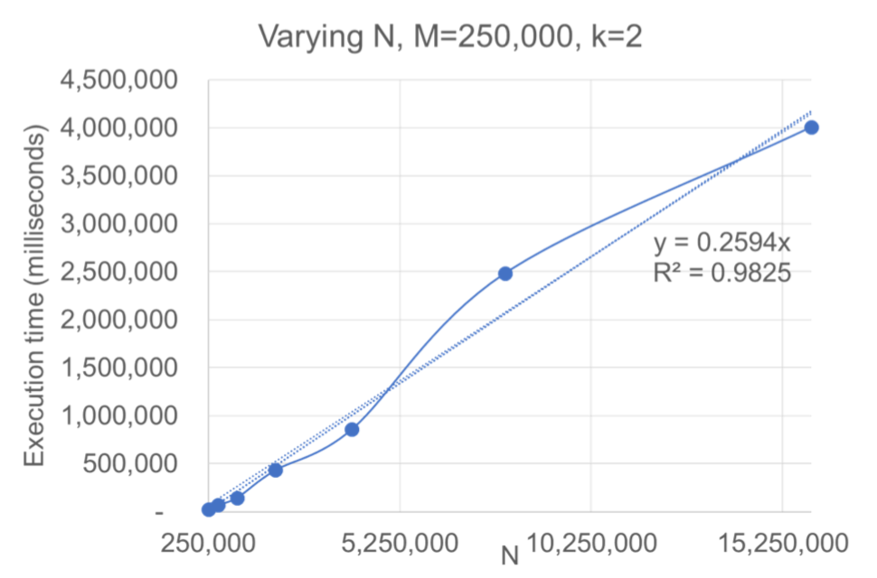
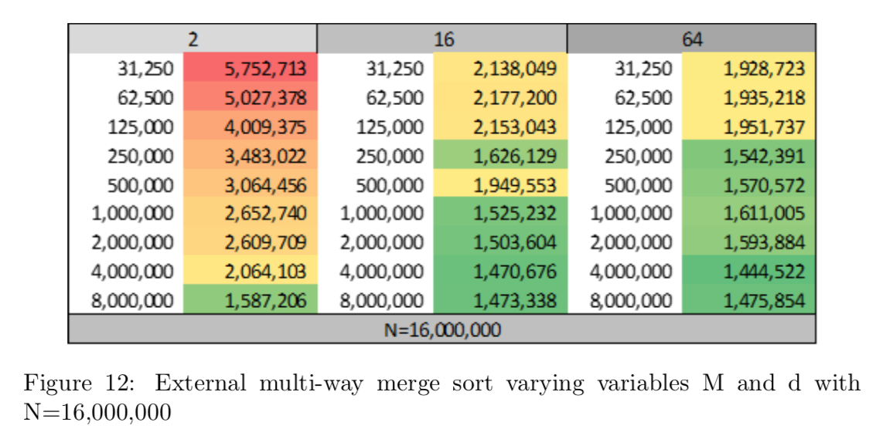
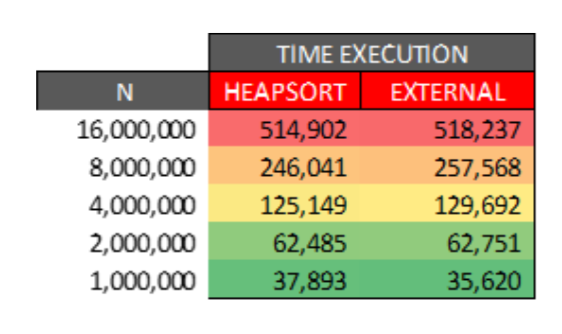

# This repo contains the code for the external memory merge-sort algorithm 

Please, take a look to the [report](https://github.com/sergiers3/external--memory-merge-sort-algorithm-/blob/master/Report.pdf) for further info!

## Intro:
The purpose of this assignment is to examine the performance of an external- memory merge-sort algorithm under different parameters. The project is made up of two parts. The first section explores and evaluates four different ways to read data from, and write data to secondary memory (read & write, freed & fwrite, fread & fwrite with buffer size, and read & write through memory map- ping). In the second section, the external multi-way merge-sort algorithm uses the most performant stream implementation to read and write data to disk. This algorithm was implemented according to the specifications described by Garcia-Molina, Ullman & Widom (2016). Finally, the differences and similari- ties between the expected and observed behavior are discussed, as well as the most convenient parameters for varying input sizes.

For the purposes of stream testing, 30 different files (k) were generated, each with 64,000,000 integers MB (N). While files of different size (N) were prepared for the External Multi-way Merge Sort Test. Regarding the sizes of the files, N = 1,000,000 integers was taken as a basis to multiply or divide by powers of 2.
For each experiment, the average execution time of 10 repetitions was cal- culated to level the fluctuations associated with other processes. The Sys- tem.currentTimeMillis() method was used to time the execution of the tests in milliseconds. java.util.Random was used to generate a stream of pseudoran- dom 32-bit integers between Integer.MIN VALUE and Integer.MAX VALUE. This implementation is contained in the class RandomSample.java.

## Discussion of expected behavior vs experimental observations:
In general terms, it is confirmed that the execution time of the external merge sort is directly proportional to N, and inversely proportional to M and d.
After executing the benchmark and analyze the expected behavior, we can see that there are three critical points int the performance of the problem:
First of all, we have the size of the file N (this is, the amount of numbers that is contained in the original file). The bigger amount of numbers we have to deal with, the bigger is the I/O cost. This increment has a mostly linear component that can be traced to N ∗ logdN. So, incrementing N will impact negatively to the cost and the time of execution.

Secondly, we got M, which represents the size of each batch in which is splitted the original file in the first pass. This batches will be merged lately in the merge phase. The bigger M is, the less amount of Streams will be merged lately. Because of this, the bigger amount of streams we have, the bigger will be the executions of the merge (this is, if d has always the same value during
the execution). The results of increasing the size of M for N1 = 1,000,000 and N2 = 16,000,000 are in line with the expectations of the effect -logdM
Lastly, we got the size of the buffer d. The bigger the value of d, the bigger is the amount of streams that will be merged in parallel in the merge phase. Choosing a big d will increment the performance.
As we can see in the results, in all three cases we mentioned, our results are in line with the expected behavior. Also, we want to mention that we used the default settings of Java Virtual Machine. This is, all the resource limit of JVM are configured by default.

## Some results:

